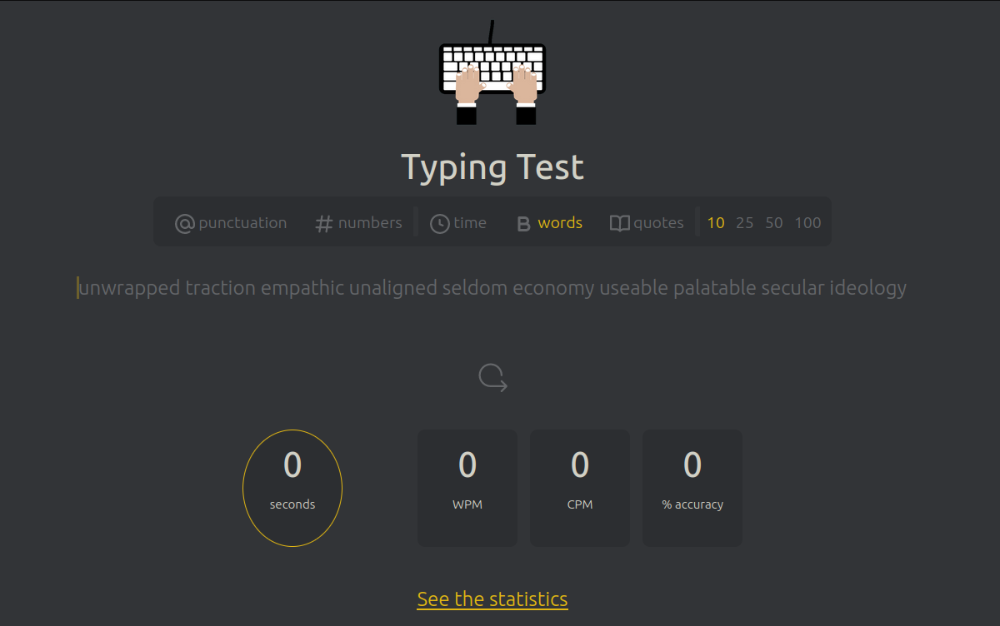
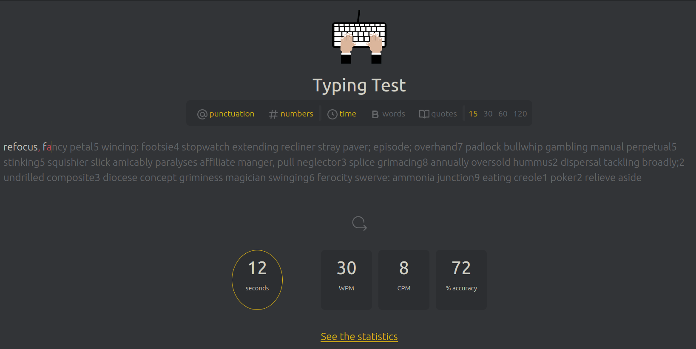

# Typing Speed Test App

The Typing Speed Test App is a dynamic web application designed to help users improve their typing skills. It features an intuitive interface for testing typing speed and accuracy, displaying text from various sources, and tracking user progress over time. It is developed as a part of the [Turing College Web Development Program](https://www.turingcollege.com/web-development).

## Table of contents

- [Overview](#overview)
  - [Key Features](#key-features)
  - [Technologies Used](#technologies-used)
  - [Screenshots](#screenshots)

## Overview

### Key Features

- **Typing Test:** Users can test their typing speed and accuracy with dynamically loaded text.
- **Real-Time Feedback:** Characters are highlighted in green or red to indicate correct or incorrect typing.
- **Timer Functionality:** A 60-second timer tracks the duration of each typing session.
- **Performance Metrics:** Calculates and displays typing speed (words per minute) and accuracy percentage.
- **Progress Tracking:** User metrics are stored and displayed over time, showing improvement and consistency.
- **Interactive UI:** Allows the use of keyboard shortcuts for test control and features an appealing layout.
- **Responsive Design:** The app is fully responsive, ensuring a seamless experience across various devices.

## Technologies Used

- **HTML/CSS/JavaScript:** Core web technologies for structure, styling, and functionality.
- **CSS:** Modular files for different components (`header.css`, `main.css`, etc.).
- **JavaScript:** Separate files for specific functionalities (`graph.js`, `screenController.js`, etc.).

### Screenshot

